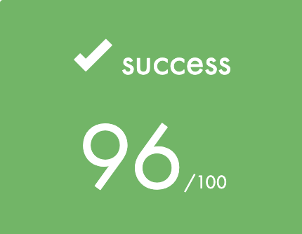

# <h1 align="center"> <a href="https://github.com/AtibQur/so_long/blob/pdf_cub3d/Cub3d.subject.pdf" target="_blank">Cub3D 🎮</a> </h1>

<h2>Description Cub3D 🕹️</h2>
This project is inspired by the world-famous eponymous 90's game, which was the first FPS ever. It will enable you to explore ray-casting. Your goal will be to make a dynamic view inside a maze, in which you'll have to find your way.

  

<h2>Rules</h2>
<li>The W, A, S, and D keys must be used to move. </li>
<li>The ← and → arrow keys should rotate your screen.</li> 
<li>The player should not be able to move into walls.</li>
<li>Your program has to display the image in a window</li>
<li>The management of your window must remain smooth (changing to another window, minimizing, and so forth).</li>
<li>Pressing ESC must close the window and quit the program in a clean way.</li>
<li>Clicking on the cross on the window’s frame must close the window and quit the program in a clean way. </li>
<li>The map must be closed with walls and there should be no empty spaces.</li>
<li>The map file should end with a .cub extension.</li>
 

<h2>Installation ⚙️</h2>
*To build the programm there is only a few steps: First of all, you can download the repository through the following steps in any shell of your preference:*
 
<pre>
git clone git@github.com:AtibQur/cub3d.git
cd cub3d
make
</pre>
These commands will compile everything and a executable <em>"cub3D"</em> should be created. 
  

<h2>Usage 🛠️</h2>

To compile the program, run the following command:

<pre>
cd cub3d && make
./cub3d input/(map_name).cub
</pre>
After creating the executable, the function is ready for use. This function only takes a map with an .cub extension.
  

<h2>Third-party helpers/testers</h2>
<li>https://lodev.org/cgtutor/raycasting.html</li>
<li>https://github.com/codam-coding-college/MLX42</li>
<li>https://permadi.com/1996/05/ray-casting-tutorial-1/</li>